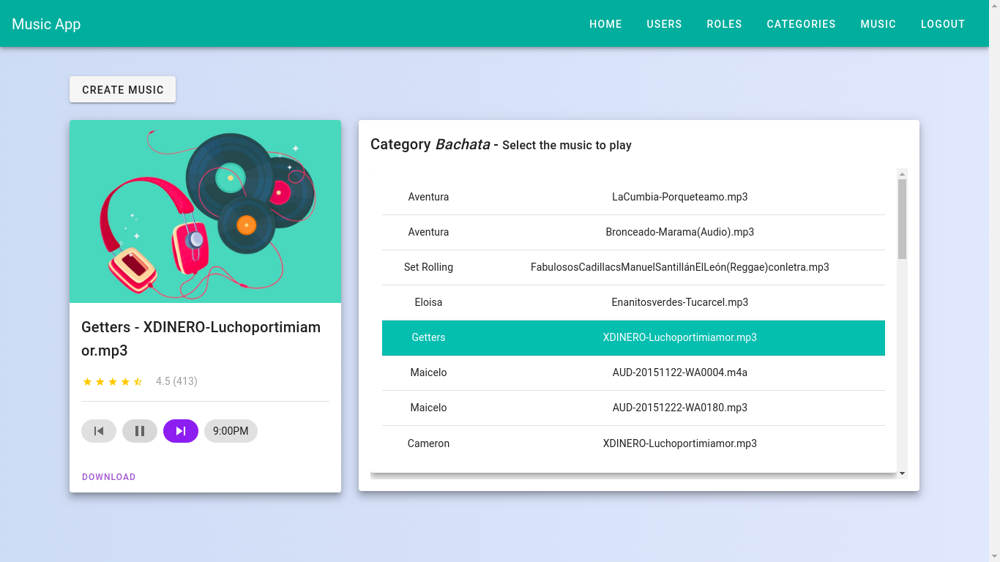
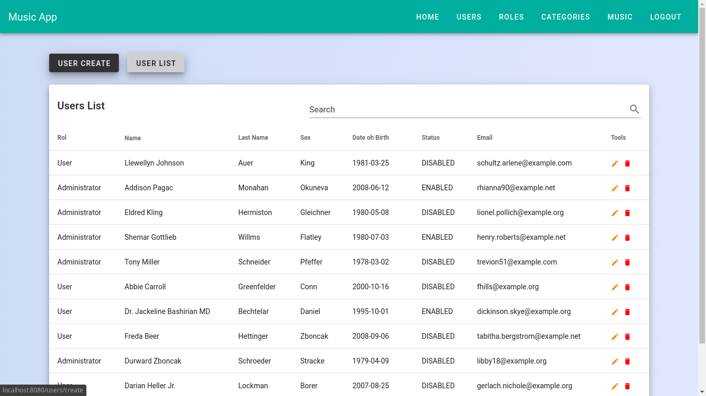
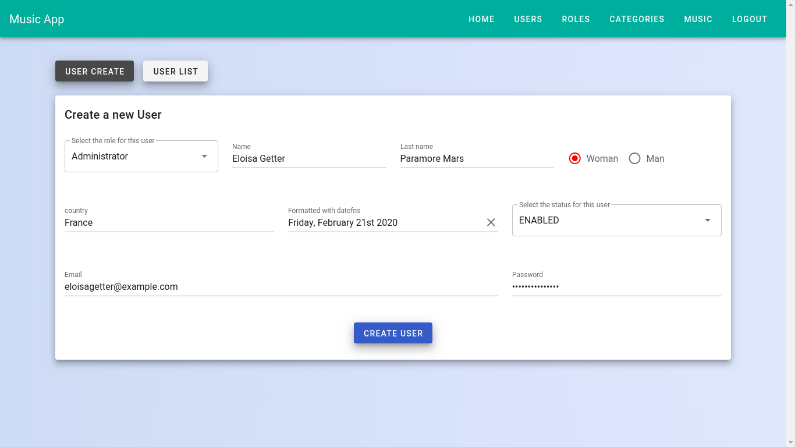

# App Music

## Description
This project is created with **Vue**, which consumes an [Api](https://github.com/JuanJoseStone/Api-App-Music "Api AppMusic") created in **Laravel**.

App Music is an application in which each person can listen to all the music it contains and in addition to being able to load and save their own music in the application and be able to listen to it at any time.

The music is divided into example categories (*Bachata*, *Salsa*, etc.).

Only users with permissions can create new categories and add new users and roles (still under **development**)

### Project setup
```
npm install
```

#### Compiles and hot-reloads for development
```
npm run serve
```


#### Screenshots

##### Listening to Music


##### List User


##### Create User

